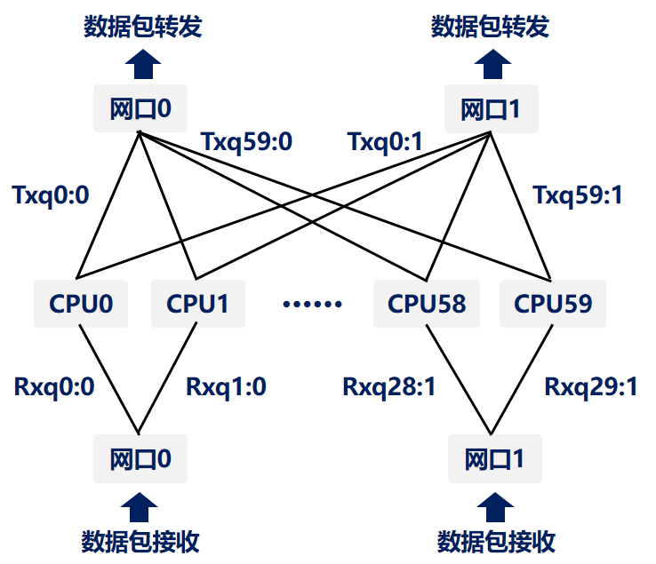
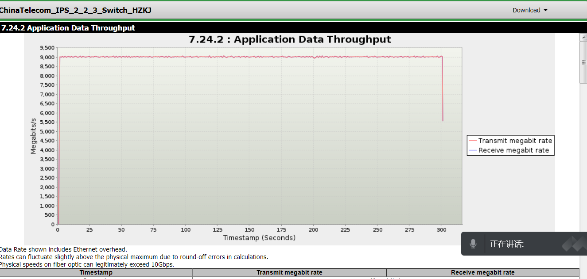

# Work
- 将DPDK收发包模块扩展到suricata-6.0.3
```
runmode-dpdk.c、runmode-dpdk.h：读取配置文件，初始化dpdk模块的一些配置，创建mempool，创建多线程并绑定CPU、设置收包队列等。
source-dpdk.c、source-dpdk.h：注册收发包模块的函数、轮询收包函数、发包函数等。
在suricata.c等其它文件中，对比其它收发包模块注册的流程，将dpdk收发包模块扩展到suricata中：
RegisterAllModules、RunModeRegister：注册DPDK抓包模式，即对初始化函数指针赋值，在RunModeDispatch中调用，进行初始化。

RunModeDpdkWorkers：
为每个收包队列创建workers模式的流处理线程并运行所有模块的线程初始化函数（线程信息结构体中记录了当前线程要管理的队列的id、portid、route表等）；
为每个流处理线程都配置（收包、解码、流处理、回复4个模块）；
为每个核心创建发包缓冲区并初始化。

ReceiveDpdkLoop：
通过轮询模式从网卡中收包，使用rte_eth_rx_burst收包；
将收到的数据包用rte_prefetch0预存取一部分到cache中，然后处理数据包，每处理完一个会再次预存取一部分数据包，防止缓存污染；
dpdk没有网络协议栈，包的解码、流的重组等工作需要用户空间的应用程序自定义，由于时间缘故，依然采用suricata自己的包处理流程，将包发向TmThreadsSlotProcessPkt，由suricata原本的逻辑进行解码、流重组、规则过滤等。

DpdkFowardPacket：
根据规则匹配时确定的包的ACTION，判断是forward还是drop，由于使用了suricata内的包处理逻辑，要释放Packet的内存！！！
```
- 添加使用lpm路由的模块，在yaml中可以配置
```
在dpdk线程信息结构体中添加'struct rte_lpm'成员，用于存储路由信息，可以在yaml中配置，由于没有arp协议模块，除了IP外还要配置MAC。
```
- 编写过滤规则：
```
根据恶意流量包（每种攻击有多个不同的包，并有确定的cve号来查询漏洞相关信息）和漏洞信息编写过滤规则，使用的是用suricata的规则语法，在ALL_Final文件中。
```
- 调试测试吞吐量，修复程序中的问题：
```
分别以网关模式，loopback模式，使用Trex发送恶意数据包进行性能和功能的测试。
修复的问题：
1. mempool初始化时参数不正确，造成空间浪费。
2. 包转发或丢弃后，没有像其它收发包模块一样是否Packet内存，造成了内存泄露，已修复。
3. 将线程数、预存取包的数目等配置信息添加到yaml中，保证IPS能适应不同的服务器配置。
```
- 使用Hyperscan库提高正则匹配性能：
```
suricata允许使用hyperscan作为正则匹配库来替换AC算法。
在飞腾、麒麟、x86多个平台中成功测试hyperscan。
```
# PNG
- 收包队列、发包队列与CPU绑定图

- 鲲鹏系统上测试结果图（万兆网卡）

